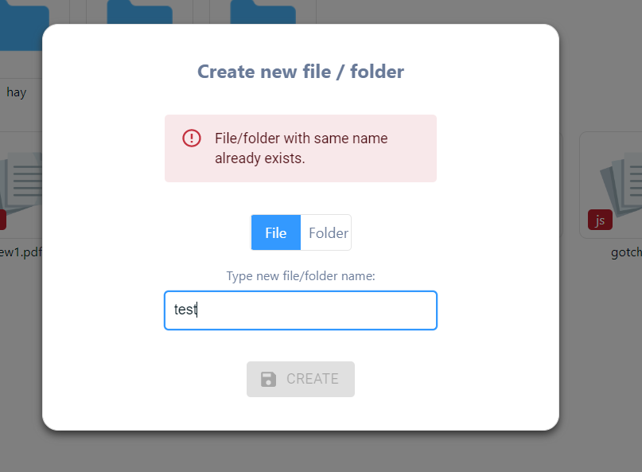

# Getting Started with One-drive React App

Creating an “Online drive” which allows users to manage files like Google
Drive.

## Available features

:heavy_check_mark: Browse through any folder by double-clicking on it.
:heavy_check_mark: Create file and folder
:heavy_check_mark: Delete file and folder
:heavy_check_mark: Rename file and folder
:heavy_check_mark: Navigate using breadcrumbs along with back button
:heavy_check_mark: Prevent duplicate file/folder creation
:heavy_check_mark: Prevent empty(blank/white space) to set file/folder name
:heavy_check_mark: Search file and folder by name
:heavy_check_mark: Persistent state implemented that you can find you files and folder when you want, only removed/deleted by user action.
:heavy_check_mark: Light and dark themes implemented for better user experience
:heavy_check_mark: Mobile responsive

### Snapshots of project 👇

# In the project directory, you can run:

### `npm start`

Runs the app in the development mode.\
Open [http://localhost:3000](http://localhost:3000) to view it in your browser.

The page will reload when you make changes.\
You may also see any lint errors in the console.

### `npm test`

Launches the test runner in the interactive watch mode.\
See the section about [running tests](https://facebook.github.io/create-react-app/docs/running-tests) for more information.
### Code Splitting

This section has moved here: [https://facebook.github.io/create-react-app/docs/code-splitting](https://facebook.github.io/create-react-app/docs/code-splitting)

### Analyzing the Bundle Size

This section has moved here: [https://facebook.github.io/create-react-app/docs/analyzing-the-bundle-size](https://facebook.github.io/create-react-app/docs/analyzing-the-bundle-size)

### Making a Progressive Web App

This section has moved here: [https://facebook.github.io/create-react-app/docs/making-a-progressive-web-app](https://facebook.github.io/create-react-app/docs/making-a-progressive-web-app)
